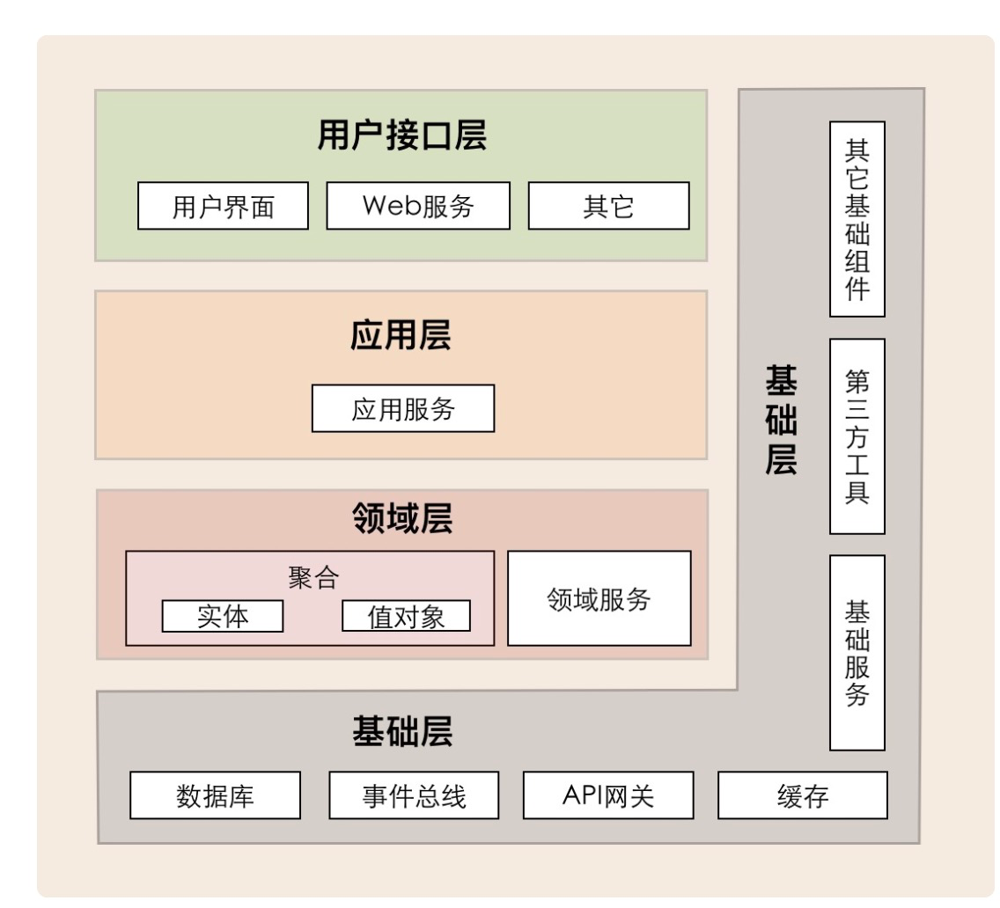
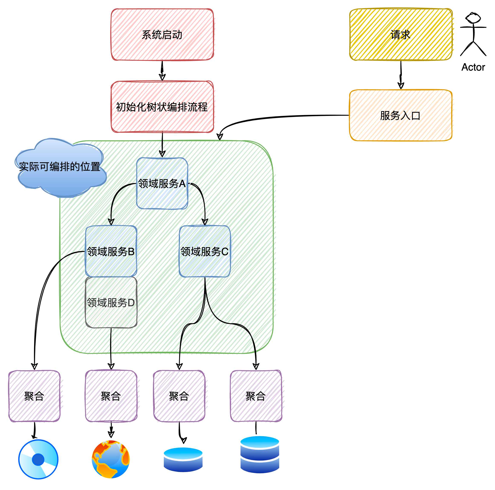

## 框架说明
### 一 背景 
#### 概述 
    在单体/微服务应用下，随着业务的复杂度不断提高，业务功能不断迭代，在保证业务快速发展的前提下，如何写出更可靠、复用的代码成为了难题，为了尝试解决该问题，衍生出了一套自己的方法.
    主要想解决以下业务中碰到的一些问题
    1、业务核心流程不清晰
    2、业务核心功能不清晰，导致开发时到处写if
    3、边界混乱,业务和业务、业务和技术相互依赖
    5、缺乏系统性的规范，如异常、code等
    6、开发不规范
> 本方案主要是使用单体应用内，尝试解决的是单体内问题。
#### 目标
    业务：领域编排 可插拔(易拓展) 稳定 易用 复用
    技术：ddd spring netty pool thread engine zk redis lock tree dag  
### 二 DDD的基本结构
 DDD的整体架构如下



 具体编程规范可以参考 com.yilun.gl.dof.excute.framework.ddd的分包
### 三 编排核心结构
画了个示意图 实在没想好怎么画合适



### 四 使用说明
#### 一、引入相关starter依赖
    <groupId>org.apache.dof</groupId>
    <artifactId>biz-dof-spring-boot-starter</artifactId>
    <version>最新版本</version>
#### 二、自定义业务逻辑的处理-编排组件
    实现父接口 com.gl.dof.core.excute.framework.logic.DomainService 其核心接口如下
```java
public interface DomainService{
    /**
    * 执行操作，判断当前领域服务是否应该执行
    */
    boolean  isMatch(HandleContext context);
    /**
    * 业务逻辑实现处，实际写业务逻辑的地方，建议是对聚合根进行编排
    */
    LogicResult doLogic(HandleContext context);
    /**
    * 回滚操作，当doLogic执行失败，或者主链路失败时的回滚操作
    */
    void reverse(HandleContext context, LogicResult logicResult);
}
```
eg.AddressDoSvr中默认bean的名字是addressDoSvr,这个bean的命名很重要 接下来会用到
```java
@Component
public class AddressDoSvr implements DomainService {
	public static String addressKey = "address";
	public static String addressKey2 = "address2";
	@Override
	public boolean isMatch(HandleContext context) {
		return true;
	}
	@Override
	public LogicResult doLogic(HandleContext context) {

		String address = "北京市海淀区";
		String address2 = "北京市海淀区quququq";

		context.attr(String.class, addressKey).set(address);
		context.attr(String.class, addressKey2).set(address2);
		return LogicResult.createSuccess();
	}
}
```
#### 三、使用application
在需要使用bean的地方引入属性   private DofExecutor<REQ, RES> ,并用注解@DofReference指定功能和编排逻辑，如下所示
```java
public class EntryTest {
		@DofReference(funcKey="test1",logicFlow ="[addressDoSvr,channelDoSvr]," +
		"grayDoSvr,libraDoSvr," +
		"[nameDoSvr,persionSelectDoSvr]," +
		"responseDoSvr, spaceDoSvr,strategyResponseDataDoSvr, tripDoSvr")
        private DofExecutor<TestRequest, TestResponse> test1;

        @DofReference(funcKey="test2",useCommonPool = false, corePoolSize = 20, logicFlow ="[addressDoSvr,channelDoSvr]," +
		"grayDoSvr,libraDoSvr," +
		"[nameDoSvr,persionSelectDoSvr]," +
		"responseDoSvr, spaceDoSvr,strategyResponseDataDoSvr, tripDoSvr")
        private DofExecutor<TestRequest, TestResponse> test2;
}
```
然后使用 DofExecutor接口中的方法doLogicSchedule 即可完成整次调用，完整代码如下
```java
@RestController
@Slf4j
public class EntryTest {
	@DofReference(funcKey="test1",logicFlow ="[addressDoSvr,channelDoSvr]," +
			"grayDoSvr,libraDoSvr," +
			"[nameDoSvr,persionSelectDoSvr]," +
			"responseDoSvr, spaceDoSvr,strategyResponseDataDoSvr, tripDoSvr")
	private DofExecutor<TestRequest, TestResponse> test1;

	@GetMapping(path = "/get/test")
	public void entryTest(){
		TestRequest testRequest = new TestRequest();
		testRequest.setName("汤姆");
		TestResponse testResponse = test1.doLogicSchedule(new Input<TestRequest>() {
			@Override
			public void doIn(HandleContext ctx) {
				ctx.attr(TestRequest.class).set(testRequest);
			}
		}, new Output<TestResponse>() {
			@Override
			public TestResponse doOut(HandleContext ctx, LogicResult logicResult) {
				if(ctx.hasAttr(TestResponse.class)){
					return ctx.attr(TestResponse.class).get();
				}
				return null;
			}
		});
		log.info("EntryTest_someThing2Application_TestResponse2={} ", testResponse);
		Assert.assertNotNull(testResponse);
	}
}
```

#### 五、补充-@DofReference说明
>子编排中可以继续使用-@DofReference注解.
>
    funcKey：    编排功能的标识key，当一个key在多个bean中使用时，为了保证编排流程(logicFlow)的一致性
                建议提取出该key和编排流程(logicFlow)到配置文件或者单独bean对象里面
    logicFlow：  编排流程 目前仅支持英文 , 和 []。其中 ,表示前后是串行执行，[]内部的表示并行执行，[]内部也可以用,分隔
                    如果想编排子逻辑，只需要再次使用该注解即可
    execTypeSel：编排引擎 当前只支持类树结构
    corePoolSize：编排引擎的线程池的核心线程池数量，当有多个编排配置了corePoolSize，则会取Max(corePoolSize)
    useCommonPool：是否使用通用线程池，如果不使用，会以funcKey作为新线程池的唯一标识，核心线程数则使用corePoolSize
    
#### 五、补充-DofExecutor<REQ, RES>说明
     固定注入的属性，目前限定了只有一个方法#doLogicSchedule，泛型为改方法的出入参，具体转换可使用HandleContext进行转换
     其中的Input<TestRequest>和Output<TestResponse>则是使用了接口，来保证出入参到HandleContext下文中的转换

#### 五、补充-HandleContext
    继承自 AttributeMap，有如下关键方法
```java
public interface HandleContext extends AttributeMap{
	<T> Attribute<T> attr(Class<T> c);
	<T> Attribute<T> attr(Class<T> c, String alias);
	<T> boolean hasAttr(Class<T> c);
	<T> boolean hasAttr(Class<T> c, String alias);
}
```
    用来获取HandleContext上下中的一些对象，线程安全
#### 五、补充-TreeApplicationExecutor
    编排执行器，是父接口 LogicExecutor 的树结构的一种实现，有如下关键方法
```
    LogicResult doLogicSchedule(HandleContext ctx);
```
     
### 五 使用示例
#### 单侧启动 
    由于使用了jdk17 单侧启动需要增加参数--add-opens java.base/java.lang=ALL-UNNAMED 
#### 启动类 
    com.yilun.gl.dof.excute.framework.usage.client.EntryTest.entryTest
#### 构建流程类
    com.yilun.gl.dof.excute.framework.application.SomeThingApplication
### 六 其他
#### 1、如何实现DagApplicationExecutor，将编排框架升级为有向无换图结构，可以更加的灵活的编排领域服务？
#### 2、如何更加优雅的使用大的context，全局使用一个大的上下文数据结构不是很优雅？？
###### dof-0.0.1:采用全局context 需要使用者自己继承context，添加自己需要属性 
>该方式经过实际验证,详细使用实例在tag[dof-0.0.1]上面
###### 最新master:采用AttributeMap的形式去构建，参考netty
>目前基本开发完成
#### 3、目前框架实现的编排领域服务，是否有必要对聚合根进行编排？？
### 七 版本说明
    dof-0.0.1 
